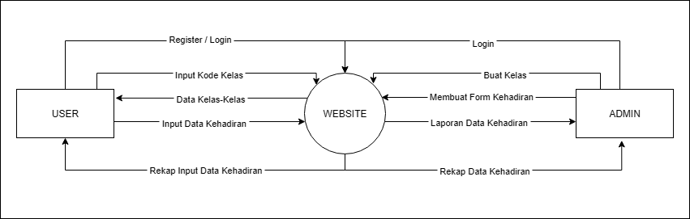
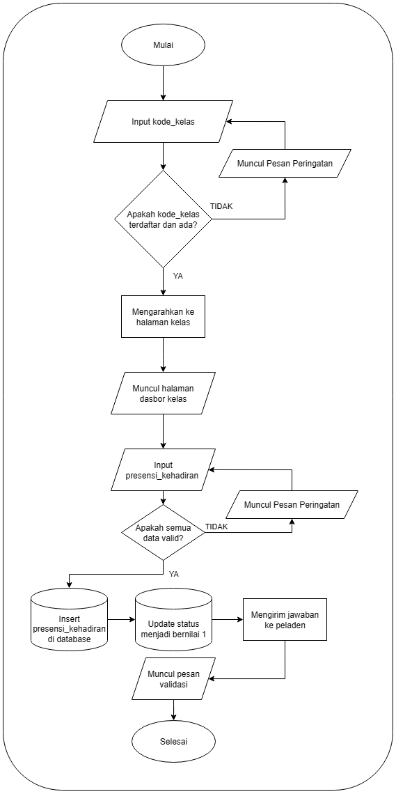
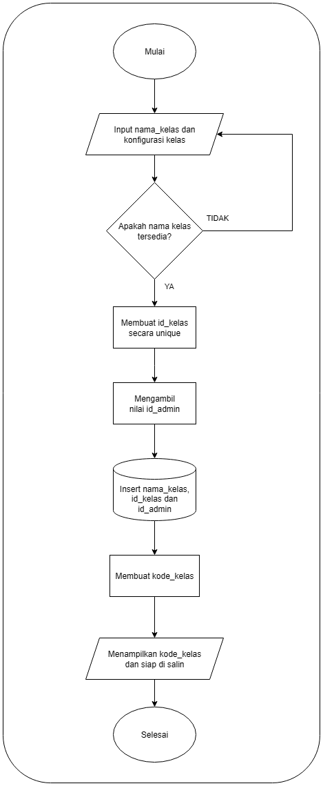
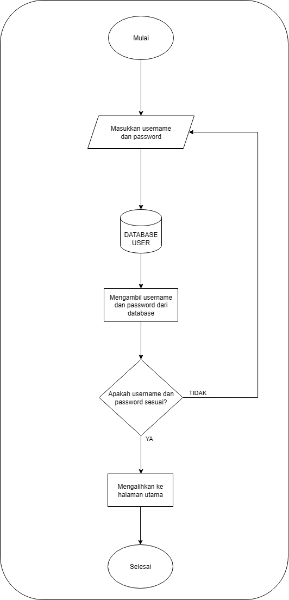
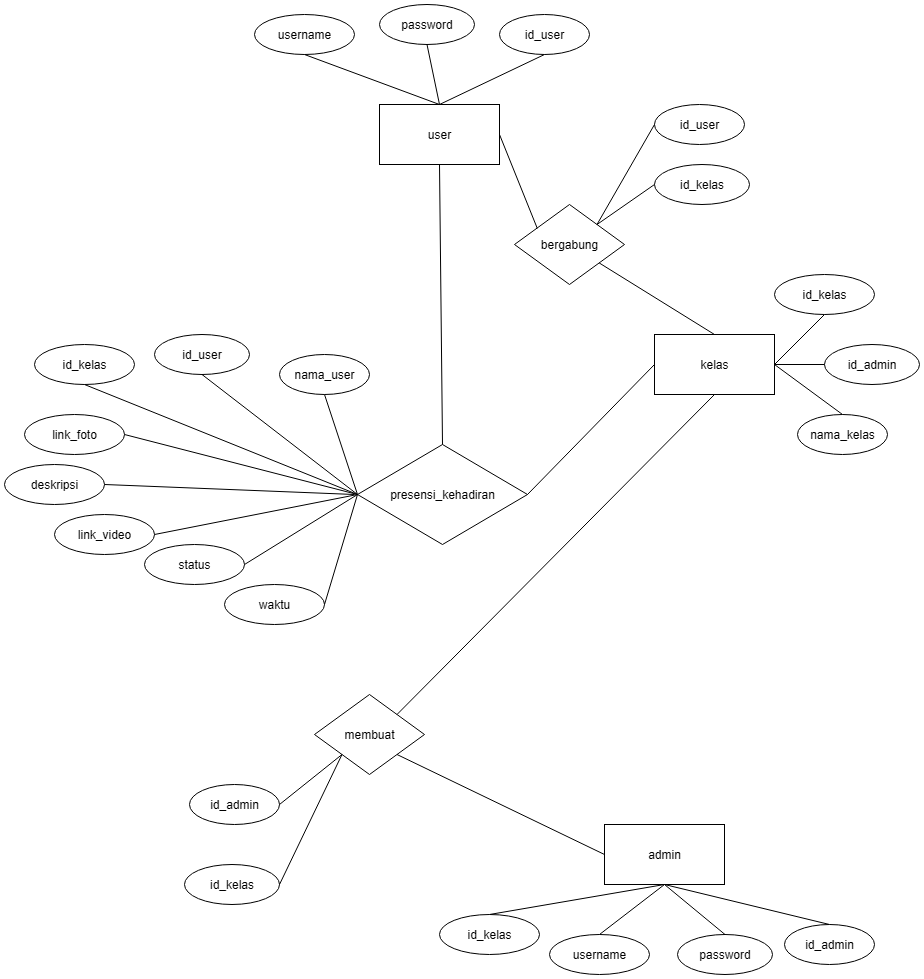

<p align="center">
  
</p>


<p align="center">
  <a href="#" target="_blank">
    
  </a>
</p>

<p align="center">
  <a href="#"></a>
  <a href="#"></a>
  <a href="#"></a>
  <a href="#"></a>
</p>

<h2 align="center">📌 Ab.sen — Aplikasi Presensi Online Berbasis Website</h2>

<p align="center">
  Presensi kapan saja, di mana saja, dengan verifikasi wajah dan video untuk kehadiran yang lebih autentik.
</p>

---

## 📖 Tentang Ab.sen
**Ab.sen** adalah aplikasi presensi online berbasis **PHP, Laravel, dan Bootstrap** yang dilengkapi dengan **verifikasi foto wajah dan perekaman video minimal tiga detik** untuk memastikan keaslian data kehadiran.  
Dengan desain responsif, sistem keamanan yang kuat, dan penyimpanan data terpusat, Ab.sen memudahkan proses absensi di instansi, sekolah, atau perusahaan **kapan saja dan di mana saja**.

---

## ✨ Fitur Utama
- 📸 **Verifikasi Wajah** dengan unggah foto & video minimal 3 detik.  
- 🌐 **Akses Web** dari perangkat apa saja yang terhubung internet.  
- 📊 **Laporan Kehadiran** otomatis & riwayat presensi.  
- 🔒 **Keamanan Data** dengan enkripsi & kontrol akses.  
- 🖥 **Antarmuka Responsif** menggunakan Bootstrap 5.  
- ⚡ **Integrasi Fleksibel** dengan sistem manajemen SDM.  

---

## 🛠️ Teknologi yang Digunakan
- **Backend:** PHP 8.x, Laravel 11.x  
- **Frontend:** Bootstrap 5, Blade Templating  
- **Database:** MySQL / MariaDB  
- **Keamanan:** Enkripsi data, kontrol hak akses  
- **Hosting:** Web-based (tidak memerlukan perangkat khusus)  

---

## 📊 Diagram Sistem

### DFD Level 0
<p align="center">
  
</p>

---

### Flowchart User
<p align="center">
  
</p>

---

### Flowchart Admin
<p align="center">
  
</p>

---

### Flowchart Login
<p align="center">
  
</p>

---

### ERD (Entity Relationship Diagram)
<p align="center">
  
</p>

---

## 📂 Struktur Database (Ringkas)
| Tabel | Deskripsi |
|-------|-----------|
| **Admin** | Kelola sistem & data kelas |
| **User** | Akses presensi & profil |
| **Kelas** | Data kelas & relasi dengan user |
| **Presensi** | Data kehadiran, foto, video, status |
| **Bergabung** | Relasi user ↔ kelas |

---

## 🚀 Instalasi
```bash
# Clone repository
git clone https://github.com/Marvellbrazil/Ab.sen.git
cd Ab.sen

# Install dependencies
composer install
npm install && npm run dev

# Setup environment
cp .env.example .env
php artisan key:generate

# Konfigurasi database di file .env
php artisan migrate --seed

# Jalankan server
php artisan serve

```

---

### 📲 Hubungi Saya
<p align="center">
  <a href="https://www.instagram.com/akufaisal._/ target="_blank">
    
  </a>
  <a href="https://www.linkedin.com/in/marvello-faisal-912132318/" target="_blank">
    
  </a>
</p>
