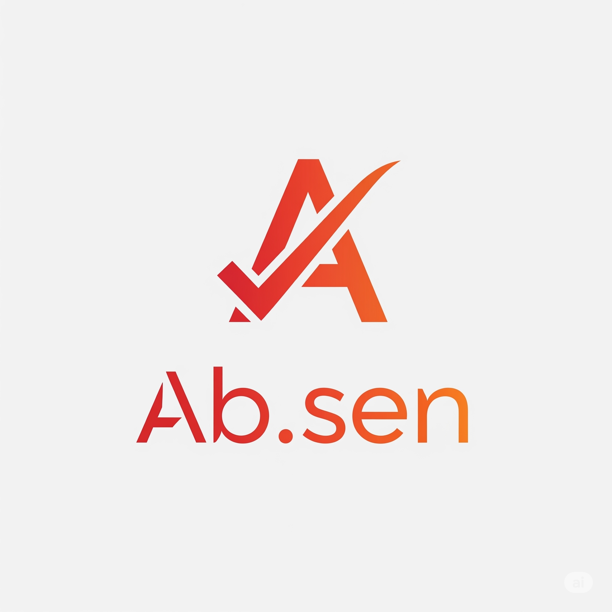

<!--<p align="center">
  
</p>-->

<p align="center">
  <a href="#" target="_blank">
    
  </a>
</p>

<p align="center">
  <a href="https://laravel.com/"></a>
  <a href="https://www.php.net/"></a>
  <a href="https://getbootstrap.com/"></a>
  <a href="LICENSE"></a>
</p>

<h2 align="center">📌 Ab.sen — Aplikasi Presensi Online Berbasis Website</h2>

<p align="center">
  Presensi kapan saja, di mana saja, dengan verifikasi wajah dan video untuk kehadiran yang lebih autentik.
</p>

---

## 📖 Tentang Ab.sen

**Ab.sen** adalah aplikasi presensi online berbasis **PHP, Laravel, dan Bootstrap** yang dilengkapi dengan **verifikasi foto wajah dan perekaman video minimal tiga detik** untuk memastikan keaslian data kehadiran.  
Dengan desain responsif, sistem keamanan yang kuat, dan penyimpanan data terpusat, Ab.sen memudahkan proses absensi di instansi, sekolah, atau perusahaan **kapan saja dan di mana saja**.

---

## ✨ Fitur Utama

- 📸 **Verifikasi Wajah** dengan unggah foto
- 🌐 **Akses Web** dari perangkat apa saja yang terhubung internet.  
- 📊 **Laporan Kehadiran** otomatis & riwayat presensi.  
- 🔒 **Keamanan Data** dengan enkripsi & kontrol akses.  
- 🖥 **Antarmuka Responsif** menggunakan Bootstrap 5.  
- ⚡ **Integrasi Fleksibel** dengan sistem manajemen SDM.  

---

## 🛠️ Teknologi yang Digunakan

- **Backend:** PHP 8.2+, Laravel 12+ 
- **Frontend:** Bootstrap 5.3+, Blade Templating Engine  
- **Database:** MariaDB  
- **Keamanan:** Enkripsi data menggunakan metode kriptografi Bcrypt dan kontrol hak akses  
- **Hosting:** Web-based (tidak memerlukan perangkat khusus)  

---

## 📊 Diagram Sistem

## 🔀 DFD Level 0

<p align="center">
  
</p>

---

## 👤 Flowchart User

<p align="center">
  
</p>

---

## 🔑 Flowchart Admin

<p align="center">
  
</p>

---

## 🔒 Flowchart Login User

<p align="center">
  
</p>

---

## 🌐 ERD (Entity Relationship Diagram)

<p align="center">
  
</p>

---

## 📂 Struktur Database (Sederhana)

| Tabel | Deskripsi |
|-------|-----------|
| **Admin** | Kelola sistem & data kelas |
| **User** | Akses presensi & profil |
| **Kelas** | Data kelas & relasi dengan user, dan admin |
| **Presensi** | Data kehadiran, foto, keterangan, dan status |
| **Bergabung** | Relasi user ↔ kelas |

---

## 🚀 Instalasi

```bash
# Clone repository
git clone https://github.com/Marvellbrazil/Ab.sen.git
cd Ab.sen

# Install dependencies
composer install
npm install && npm run dev

# Setup environment
cp .env.example .env
php artisan key:generate

# Konfigurasi database di file .env
php artisan migrate --seed

# Jalankan Vite + Laravel Mix untuk frontend
npm run build
npm run dev

# Jalankan server
php artisan serve

# Jika ingin menambahkan data dummy
php artisan tinker
\App\Models\User::factory()->count(3)->create();

```

## 📚 Dokumentasi

```bash
# Jalankan server lokal dahulu
php artisan serve

# Windows
start http://127.0.0.1:8000/docs

# MacOS
open http://127.0.0.1:8000/docs

# Linux
xdg-open http://127.0.0.1:8000/docs

# Ganti 8000 dengan port yang sesuai jika berbeda
# Jika menggunakan port lain, sesuaikan URL di atas.

```

---

## 📟 Tambahan

```bash
# Untuk membuat password yang di-hash
# Dengan menggunakan aplikasi built-in project ini
python -u "c:\xampp\htdocs\Ab.sen\Main\scripts\toolbcrypt.py"

```

---

### 📲 Hubungi Saya

<p align="left">
  <a href="https://www.instagram.com/akufaisal._/" target="_blank">
    
  </a>
  <a href="https://www.linkedin.com/in/marvello-faisal-912132318/" target="_blank">
    
  </a>
  <a href="https://wa.me/6287776810645" target="_blank">
    
  </a>
</p>

---

## 📄 Lisensi

Aplikasi ini dirilis di bawah lisensi **MIT License**. Silakan lihat file <a href="LICENSE"></a> untuk informasi lebih lanjut.

---
<p align="center" style="font-size: 60px;">Happy Coding! :D 🎉</p>
